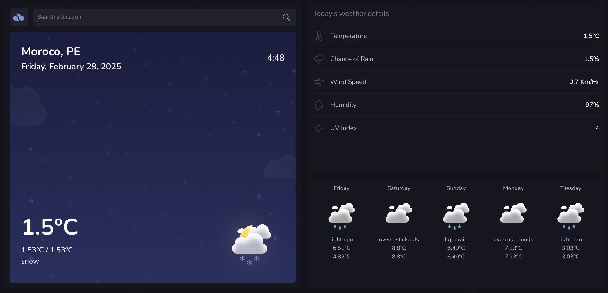

# 🌦️ TypeWeather

A sleek and dynamic weather dashboard that provides real-time weather updates and a 5-day forecast, with an intuitive and fully responsive UI.



## ✨ Features

- **🌍 Search Any City** – Smart search with auto-suggestions
- **☀️ Real-Time Weather** – Current temperature, humidity, wind speed, UV index & more
- **📅 5-Day Forecast** – Hourly and daily weather updates
- **🎨 Dynamic Backgrounds** – Changes based on weather conditions
- **📱 Responsive Design** – Works on all screen sizes
- **⚡ Live Data Updates** – Auto-refreshes every 15 minutes

## 🚀 Live Demo

👉 [Try TypeWeather Now](https://dynamic-axolotl-2be717.netlify.app/)

## 🛠️ Tech Stack

- **Frontend:** HTML, CSS, JavaScript
- **API:** [OpenWeatherMap API](https://openweathermap.org/api)
- **Icons:** Animated weather icons

## 🏗️ Installation

1. Clone the repository:
   ```bash
   git clone https://github.com/yourusername/TypeWeather.git
   cd TypeWeather
   ```
